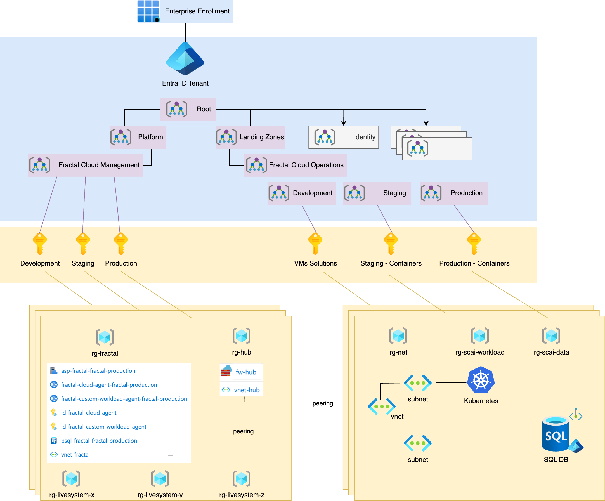

# Fractal Bank

This demo is focused on demonstrating the way our potential customers could use our product to adhere to Cloud Vendor
best practices while not having to know all the details while simplifying SDLC practices for their development teams.

Here follows an high-level architectural description of the agreed deliverable:

## Objectives

* Definition of 3 GitHub Actions
    * `environment_deployment`: deploying and initializing the environments
    * `architecture_deployment`: deploying the Fractals and initial Live Systems
    * `application_deployment`: deploying the services to the different environments
* [Azure CAF](https://learn.microsoft.com/en-us/azure/cloud-adoption-framework/ready/landing-zone/design-areas) adoption
  as per diagram (Hub-and-spoke, management groups, etc.)
* All services are deployed in private mode, communication is only performed through azure private network by peering
  the spokes to the hub, opening the correct firewall rules, and
  using [private links](https://learn.microsoft.com/en-us/azure/private-link/private-link-overview) for storage account
  and postgres sql.
* The `environment_deployment` action creates the following setup:
    * Creation of 3 Fractal Management Environments: Development, Staging, Production
    * Each Management Environment has a Fractal Cloud agent to ensure segregation between different environments, as
      shown in the diagram. Each Management Environment will have an Operational Environment, which will contain a
      single Live System (Application) as per our customer's request.
* The `architecture_deployment` action will deploy 2 Fractals and 3 Live Systems:
    * `bank-containers:v01` Fractal will be created and 2 Live Systems will be deployed on both Staging and Production
      Operational Environments
    * `bank-vm:v01` is exactly as `bank-containers:v01`, but it uses a VM instead of AKS and Storage Account instead of
      SQL. This Fractal is only deployed in a LiveSystem on the Development Operational Environment.
* The `application_deployment` action will deploy 2 sample services in each environment, one only with read access and
  the other with read/write access to the data.
* All workloads and Azure services will have
  associated [Entra Managed Identities](https://learn.microsoft.com/en-us/entra/identity/managed-identities-azure-resources/overview)
  automated and managed by Fractal Cloud, as per best practice and to granularly control access to data and other
  services.
* Observability stack will be deployed on each individual Kubernetes cluster with a basic dashboard showing services
  metrics.
* Developers can create a [cloud shell](https://learn.microsoft.com/en-us/azure/cloud-shell/vnet/overview) within a vnet
  and can connect to the VMs and Kubernetes clusters in private vnets.
